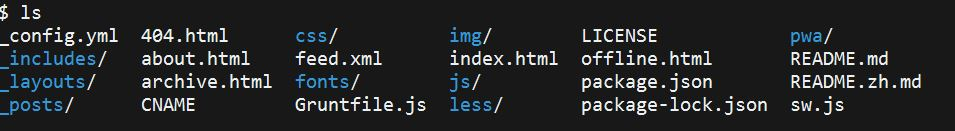

# Paradiseeee.github.io

-- 此前设置了个人主页，但是Github自带的主题太少，而且不够flexible，因此删库重建。大致记录一下过程。

## 一、寻找博客模版

对于前端小白来说，最好的方式就是参考别人的模版来做。GitHub上搜`Jekyll`或者`github.io`，就能找到一堆个人主页，挑个好看的fork下来再进行个性化。

千挑万选，找到了[黄玄](https://www.github.com/huxpro/)大神的[博客](https://huxpro.github.io)模版。直接clone下来，包含以下文件和目录：

具有较好看的页面设计，以及可以自定义评论和网页分析功能。

## 二、个性化设计

虽然号称傻瓜式操作，还是需要花点时间学习一下Jekyll和html的知识。本人没有系统地学过前端的知识，但是平时做爬虫，网页分析，大致摸索着也懂一些。对于有编程基础的朋友，应该也是摸索一下就能大致理解。关于`Jekyll`参考[我的文章](https://paradiseeee.github.io/2020/01/03/jekyll-学习笔记/)。

了解了整个仓库的结构，就可以进行页面的个性化设计。首先按照自己的喜好调整一下页面的内容，也避免与作者的设计完全重复。**做过更改的地方都在源代码中有注释。** 本地运行Jekyll服务，按照文件和参数的引用方式边看边改即可。

然后简化一下文件目录（直接clone下来的仓库目录相对较复杂，对于新建的博客只要按照标准的框架即可），最后加上自己的文章和社交账号，图片等内容。就完成了。

## 三、还存在一些问题

的确是小白，文档还有很多没看懂。根目录下的一些js、less等文件也不知道有什么用途，就先原封不动地保留在这里，有空再研究一下。

package-lock.json需要加入gitignore，不影响网页运行。直接push上去github会轰炸你的邮箱，说有安全问题blablabla。

列举一下存在问题的文件：
- _layouts/keynote.html &emsp; 好像没有用到这个文件啊？
- css &emsp; 这个文件夹怎么起作用的？
- js &emsp; 同上
- less &emsp; 同上
- offline.html &emsp; 貌似首次打开会提醒浏览的网页可以离线浏览，然后文件有update时会提示reflash，不知道是不是这个文件的原因？
- Gruntfile.js &emsp; 很厉害的样子？
- sw.js &emsp; 同上
- package.json &emsp; 大概知道有什么用
- feed.xml &emsp; nonsence？
- _config.yml &emsp; 里面的build setting里exclude了一堆文件，什么意思？

-----------------------
&emsp;有大神路过指点一下 :pray: :pray: :pray:
 

---------------------------------

    
展开<strong><em>后续更新</em></strong>

- 首页文章预览中的内容定义为：中文文章200字符，英文文章300字符。当包含在预览中的字符含有较长的英文字符，如网址链接，该段字符不会换行，手机端浏览会出现异常（文字超出页面）。可以手动进行换行或者避免出现这种情况。

- 文章（post.html）页面中的内容也有以上情况。文字不会超出页面，但是直接显示不出来。有点麻烦，要想办法解决响应式布局的问题。

- mathjax支持的问题，jekyll本地服务可以渲染出公式，但是github page显示不出来。搞了大半天，只能用一种蠢方法勉强解决。有空在研究一下。
    - 行内公式在本地渲染后将对应的p标签copy下来改一改就可以了，勉强显示
    - 行间公式请求下latex生成gif图直接本地引用

- 解决本地中文名字的markdown文件和引用的图片的问题 | [参考博客](https://blog.csdn.net/yinaoxiong/article/details/54025482)

- 将主要页面的图片改为引用CSDN中保存的图片

-  03-27 凌晨github pages打不开了，研究一下怎么把github pages部署到gitee。发现存在较多问题，主要是因为两者的jekyll引擎配置不一样。[具体参考](page-assets/ReadmeAssets/转载.md)

