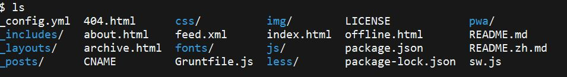

# Paradiseeee.github.io

-- 此前设置了个人主页，但是Github自带的主题太少，而且不够flexible，因此删库重建。大致记录一下过程。

## 一、寻找博客模版

对于前端小白来说，最好的方式就是参考别人的模版来做。GitHub上搜`Jekyll`或者`github.io`，就能找到一堆个人主页，挑个好看的fork下来再进行个性化。

千挑万选，找到了[黄玄](https://www.github.com/huxpro/)大神的[博客](https://huxpro.github.io)模版。直接clone下来，包含以下文件和目录：

具有较好看的页面设计，以及可以自定义评论和网页分析功能。

## 二、个性化设计

虽然号称傻瓜式操作，还是需要花点时间学习一下Jekyll和html的知识。本人没有系统地学过前端的知识，但是平时做爬虫，网页分析，大致摸索着也懂一些。对于有编程基础的朋友，应该也是摸索一下就能大致理解。关于`Jekyll`参考[我的文章](https://paradiseeee.github.io/2020/01/09/jekyll-学习笔记/)。

了解了整个仓库的结构，就可以进行页面的个性化设计。首先按照自己的喜好调整一下页面的内容，也避免与作者的设计完全重复。做过更改的地方基本都在源代码中有注释，本地运行Jekyll服务，按照文件和参数的引用方式边看边改即可。

然后简化一下文件目录（直接clone下来的仓库目录相对较复杂，对于新建的博客只要按照标准的框架即可），最后加上自己的文章和社交账号，图片等内容。就完成了。

## 三、还存在一些问题

的确是小白，文档还有很多没看懂。根目录下的一些js、css等文件也不知道有什么用途，就先原封不动地保留在这里，有空再研究一下。

package-lock.json需要加入gitignore，不影响网页运行。直接push上去github会轰炸你的邮箱，说有安全问题blablabla。

列举一下存在问题的文件：
- _includes/mathjax_support.html &emsp; 怎么support？什么情况需要？
- _layouts/keynote.html &emsp; 好像没有用到这个文件啊？
- css &emsp; 这个文件夹怎么起作用的？
- js &emsp; 同上
- less &emsp; 同上，plus，干嘛用的？
- offline.html &emsp; 貌似首次打开会提醒浏览的网页可以离线浏览，然后文件有update时会提示reflash，不知道是不是这个文件的原因？
- Gruntfile.js &emsp; 很厉害的样子？
- sw.js &emsp; 同上
- package.json &emsp; 大概知道有什么用
- feed.xml &emsp; nonsence？
- _config.yml &emsp; 里面的build setting里exclude了一堆文件，什么意思？

SOS
&emsp;有大神路过指点一下 :pray: