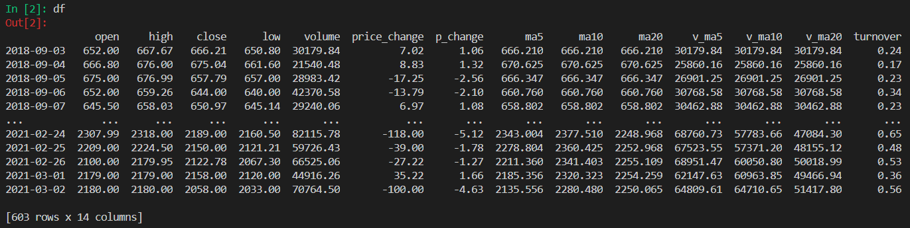

-- 时间序列数据分析的基本流程

时间序列数据即观测值存在时间顺序的数据。由于这个特点，在进行时间序列数据分析时，相关统计量的解释，以及常用的模型方法，都与非时间序列数据有较大的区别。本文以最常见的时间序列数据——股票数据为例进行数据分析，粗略了解时序数据分析的特点。

## 一、数据获取与数据预处理

例如 `tushare` 提供的接口获取数据：

```python
import pandas as pd
import tushare as ts

# 以贵州茅台（600519）为例
df = ts.get_hist_data('600519')[::-1]
df.index = pd.to_datetime(df.index)
df.index.name = None
```



> [相关阅读-Medium](https://medium.com/towards-artificial-intelligence/statistical-modeling-of-time-series-data-part-1-data-preparation-and-preprocessing-b52f26f6213c)